# 📦 Supply Chain Analytics Dashboard

<p align="center">

### Business Intelligence Platform for Supply Chain Performance Analysis

An interactive **Business Intelligence (BI) Dashboard** developed using **Python, Dash, Plotly, and Pandas** for analyzing supply chain performance through dynamic KPIs, customer analytics, operational insights, and interactive visualizations.

Designed to help business users monitor revenue trends, customer contribution, shipment performance, business segments, and geographic distribution in a single unified dashboard.

</p>

---

## 🚀 Built With

<p align="left">


</p>

---

# 📷 Dashboard Preview

<p align="center">

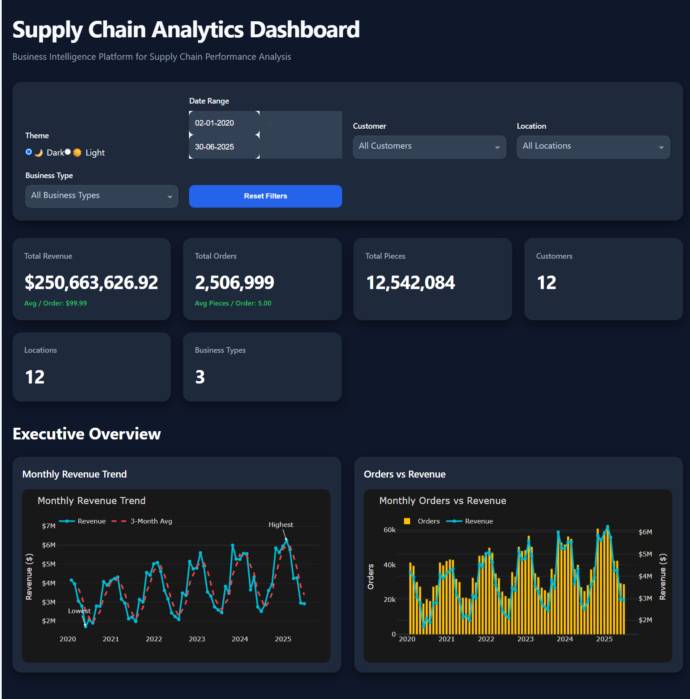

</p>

---

# 📖 Project Overview

Modern supply chains generate large volumes of transactional and operational data across customers, locations, business segments, and shipments. Transforming this data into actionable insights is critical for improving operational efficiency, optimizing logistics, increasing profitability, and supporting strategic business decisions.

The **Supply Chain Analytics Dashboard** is an interactive Business Intelligence application that converts raw operational data into meaningful visual insights using Python and Plotly Dash. The dashboard enables users to monitor key performance indicators (KPIs), analyze customer and location performance, explore shipment trends, evaluate business segment contribution, and identify revenue patterns through interactive charts and analytics.

The application has been designed with a modular architecture, making it scalable, reusable, and easy to maintain while delivering an intuitive user experience.

---

# ✨ Key Features

- 📈 Executive KPI Dashboard
- 👥 Customer Performance Analytics
- 📍 Location Performance Analysis
- 🚚 Business Segment Analytics
- 🌍 Geographic Revenue Visualization
- 📊 Interactive Charts and Visualizations
- 📅 Dynamic Date Range Filtering
- 🔎 Customer, Location & Business Filters
- 💡 Executive Insight Cards
- 📱 Fully Responsive Layout
- 🌙 Dark & Light Theme Support
- ⚡ Interactive Analytics Modals

---

# 📊 Dashboard Statistics

| Metric | Value |
|:--------------------------|------:|
| Dataset Records | **91,191** |
| Customers | **12** |
| Locations | **12** |
| Business Segments | **3** |
| Dashboard Modules | **4** |
| Interactive Charts | **12+** |
| KPI Cards | **6** |
| Executive Insight Cards | **8** |
| Analytics Modals | **8** |
| Responsive Layout | ✅ |
| Theme Support | Dark & Light |

---
# 🖥️ Dashboard Modules

The dashboard is organized into four major analytical modules, each designed to provide business users with actionable insights across different aspects of supply chain operations.

---

# 1️⃣ Dashboard Overview

The landing page provides a comprehensive overview of the organization's supply chain performance through interactive filters, KPI cards, and executive analytics. Users can quickly evaluate business performance before exploring detailed analytical modules.

### Highlights

- Interactive Date Range Filter
- Customer Filter
- Location Filter
- Business Type Filter
- Revenue KPIs
- Orders & Shipment KPIs
- Executive Overview Charts

<p align="center">


</p>

---

# 2️⃣ Complete Dashboard

The dashboard integrates multiple analytical modules into a single business intelligence platform, enabling users to transition seamlessly from executive summaries to detailed operational insights.

Major sections include:

- Executive Overview
- Customer Analytics
- Operations Analytics
- Executive Insights
- Interactive Modals
- Dynamic Filtering
- Responsive Layout

<p align="center">

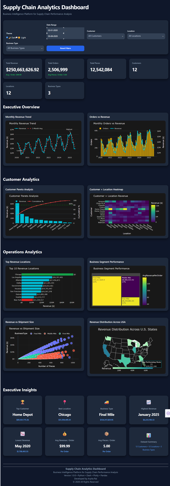

</p>

---

# 3️⃣ Customer Analytics

The Customer Analytics module helps organizations identify their highest-value customers, evaluate customer contribution, and analyze revenue distribution across locations.

### Included Visualizations

- Customer Pareto Analysis
- Customer × Location Heatmap

### Business Value

- Identify high-value customers
- Monitor customer concentration
- Discover revenue-generating locations
- Improve customer relationship strategies

<p align="center">

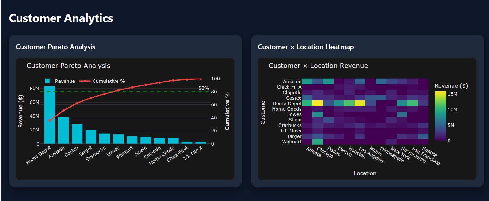

</p>

---

# 4️⃣ Operations Analytics

The Operations Analytics module provides visibility into operational performance, shipment behavior, geographic revenue distribution, and business segment contribution.

### Included Visualizations

- Top Revenue Locations
- Business Segment Treemap
- Revenue vs Shipment Scatter Plot
- U.S. Revenue Distribution Map

### Business Value

- Monitor logistics performance
- Compare business segment contribution
- Identify high-performing locations
- Understand shipment efficiency

<p align="center">

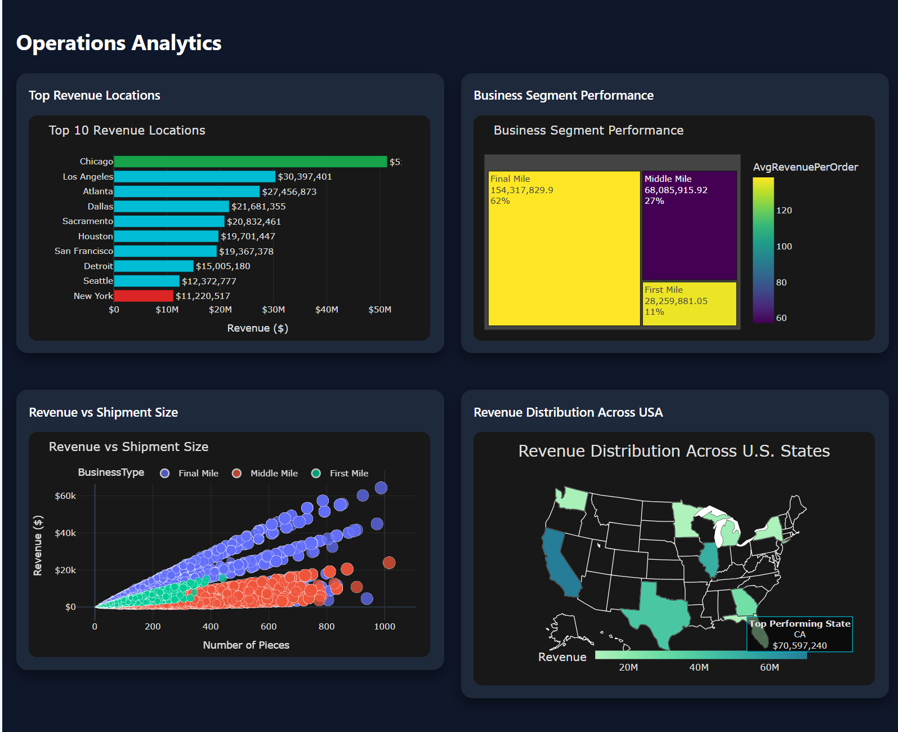

</p>

---

# 5️⃣ Executive Insights

The Executive Insights section summarizes the most important business metrics into interactive cards, enabling executives to quickly identify key performance indicators without exploring individual charts.

### Executive Cards

- Top Customer
- Best Performing Location
- Highest Revenue Month
- Lowest Revenue Month
- Business Segment
- Average Revenue per Order
- Average Pieces per Order
- Dataset Summary

<p align="center">

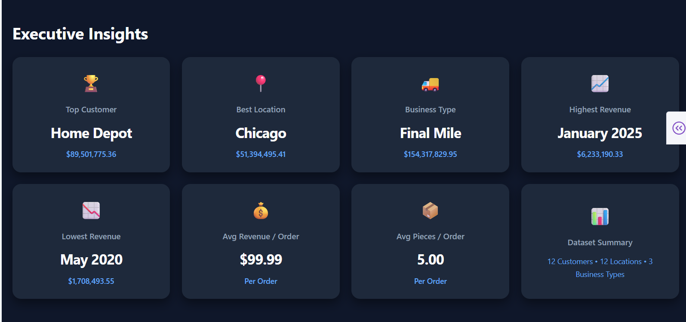

</p>

---
# 📊 Interactive Analytics Modals

To provide deeper business insights without cluttering the main dashboard, the application includes interactive analytical modals. Each modal presents detailed KPIs, additional visualizations, executive insights, and business recommendations.

---

# 👤 Customer Analytics Modal

The Customer Analytics modal provides an in-depth analysis of the organization's highest-performing customer.

### Features

- Customer Revenue
- Total Orders
- Total Shipment Pieces
- Revenue per Order
- Revenue Contribution (%)
- Monthly Revenue Trend
- Top Revenue Locations
- Business Type Distribution
- Executive Insight
- Business Recommendations

<p align="center">

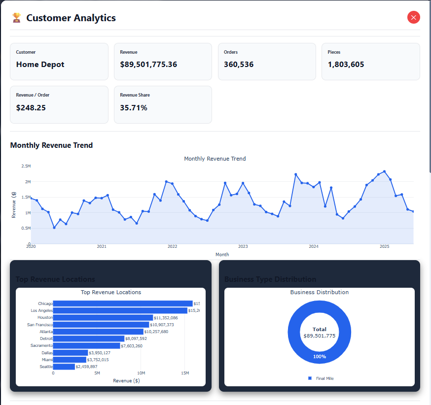

</p>

---

# 📍 Location Analytics Modal

The Location Analytics modal analyzes the best-performing geographic location based on revenue generation.

### Features

- Total Revenue
- Orders Processed
- Shipment Pieces
- Active Customers
- Revenue Share
- Monthly Revenue Trend
- Top Customers
- Business Type Distribution
- Executive Insight
- Business Recommendations

<p align="center">

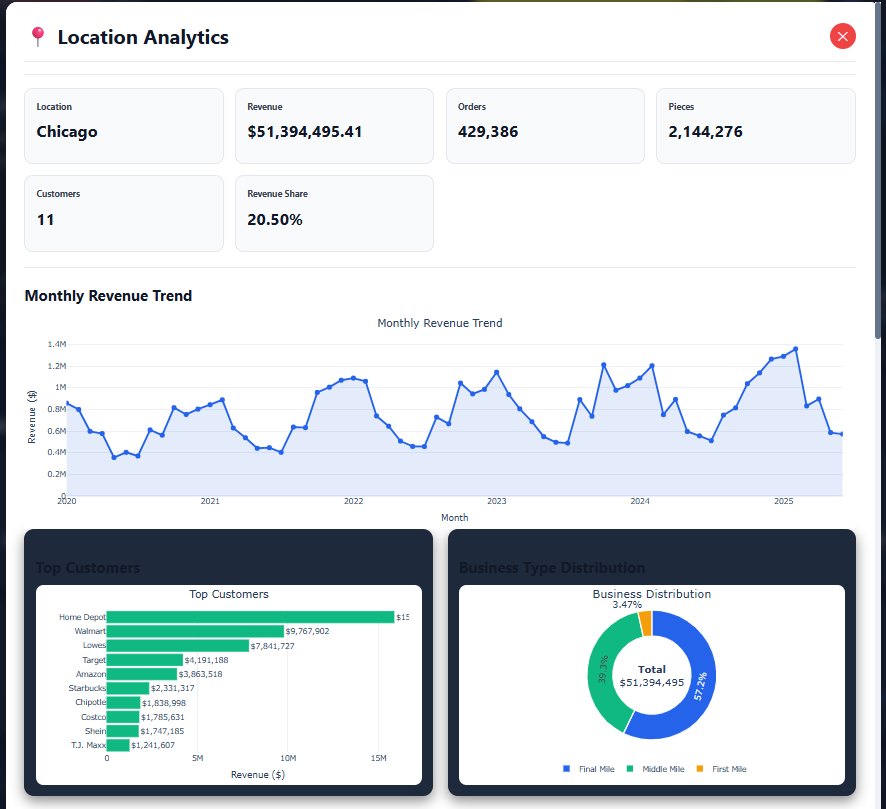

</p>

---

# 🚚 Business Analytics Modal

This modal provides detailed performance metrics for each business segment, allowing users to compare operational performance across shipment categories.

### Features

- Business Segment Revenue
- Total Orders
- Shipment Pieces
- Revenue per Order
- Revenue Share
- Active Customers
- Operating Locations
- Monthly Revenue Trend
- Top Revenue Locations
- Top Customers
- Executive Insight
- Business Recommendations

<p align="center">

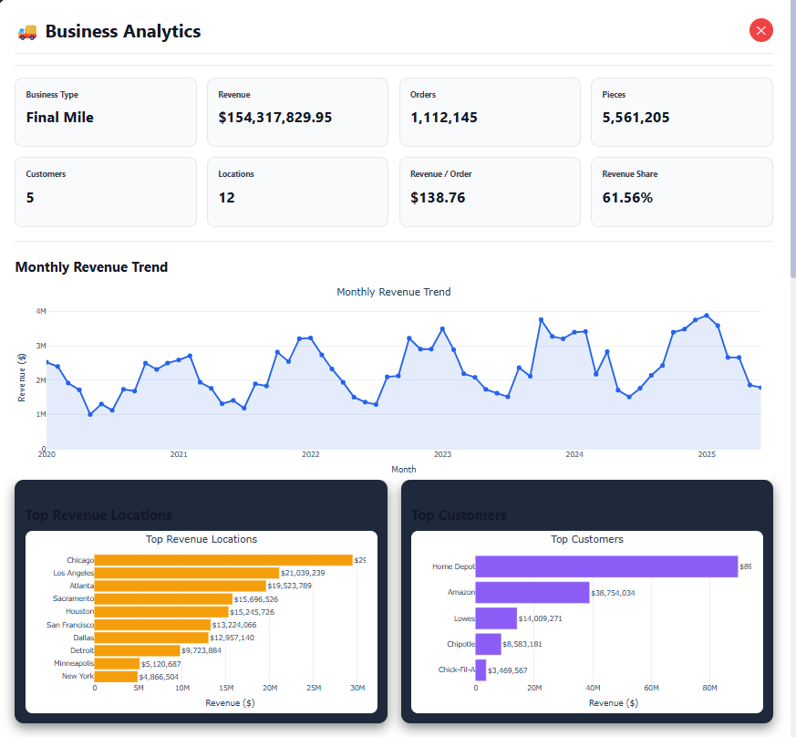

</p>

---

# 📈 Highest Revenue Month Modal

Displays the highest-performing month in the dataset together with key operational metrics.

### Information Included

- Month
- Revenue
- Orders
- Shipment Pieces
- Revenue Share
- Executive Insight
- Strategic Recommendations

<p align="center">

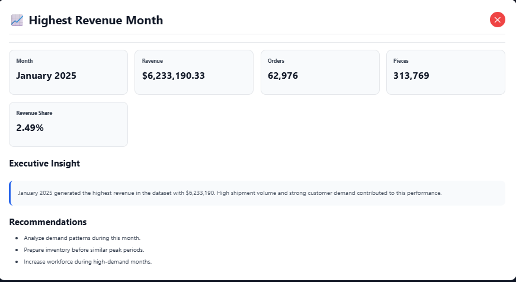

</p>

---

# 📉 Lowest Revenue Month Modal

Highlights the weakest-performing month and provides insights into potential operational improvements.

### Information Included

- Month
- Revenue
- Orders
- Shipment Pieces
- Executive Insight
- Business Recommendations

<p align="center">

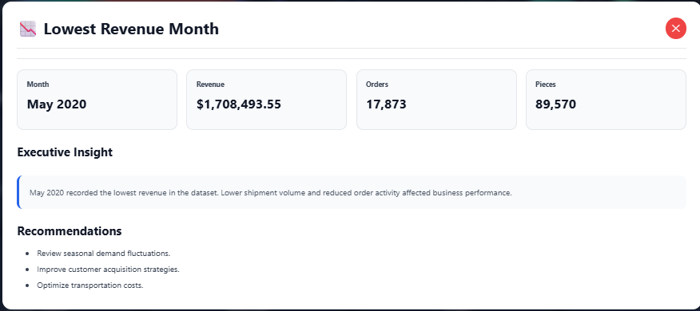

</p>

---

# 💰 Average Revenue per Order

Summarizes revenue efficiency across all customer orders.

### Metrics Included

- Average Revenue
- Median Revenue
- Maximum Revenue
- Minimum Revenue
- Executive Insight
- Business Recommendations

<p align="center">

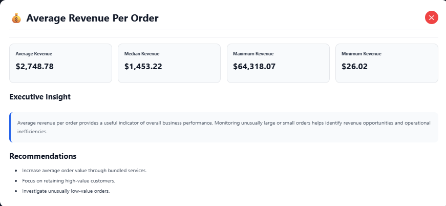

</p>

---

# 📦 Average Pieces per Order

Provides shipment efficiency metrics across the entire supply chain.

### Metrics Included

- Average Shipment Size
- Maximum Pieces
- Minimum Pieces
- Total Pieces
- Executive Insight
- Business Recommendations

<p align="center">

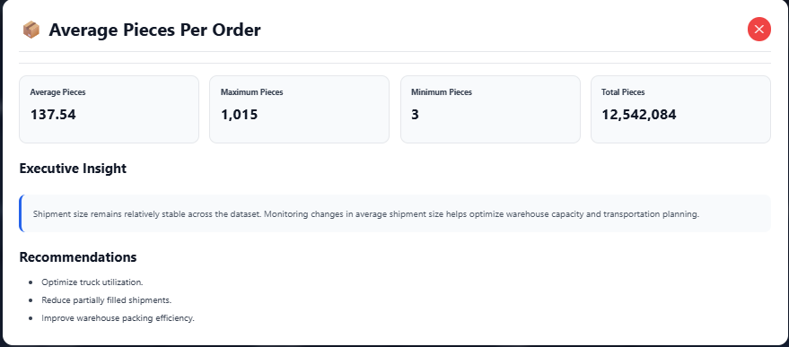

</p>

---

# 📋 Dataset Summary

Provides an overview of the dataset used for analysis.

### Summary

- Total Records
- Customers
- Locations
- Business Types
- Date Range
- Executive Insight
- Dataset Quality Notes

<p align="center">

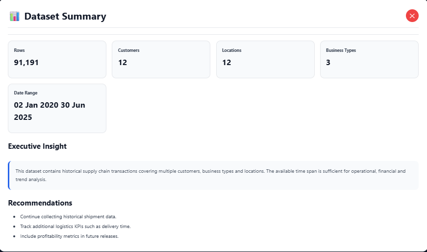

</p>

---
# 🏗️ System Architecture

The dashboard follows a modular architecture that separates data processing, business logic, visualization, and user interaction. This design improves maintainability, scalability, and code reusability.

```text
                    Supply Chain Dataset (CSV)
                               │
                               ▼
                     Data Loading & Cleaning
                      (Pandas / NumPy)
                               │
                               ▼
                     Business Logic Layer
                  KPI & Analytics Services
                               │
                               ▼
                    Plotly Visualizations
                               │
                               ▼
                  Dash Layout Components
                               │
                               ▼
                  Interactive Dash Callbacks
                               │
                               ▼
             Dashboard & Analytics Modals
```

---

# ⚙️ Technology Stack

| Category | Technologies |
|-----------|--------------|
| Programming Language | Python |
| Dashboard Framework | Plotly Dash |
| Data Processing | Pandas, NumPy |
| Visualization | Plotly Express, Plotly Graph Objects |
| Frontend | HTML, CSS |
| Backend | Dash Callback Architecture |
| Data Source | CSV Dataset |
| IDE | Visual Studio Code |
| Version Control | Git & GitHub |

---

# 📁 Project Structure

```text
Supply_Chain_Analytics_Dashboard/
│
├── assets/
│   ├── dashboard.css
│   ├── responsive.css
│   └── theme.css
│
├── callbacks/
│
├── components/
│   ├── layout/
│   └── modal_graphs/
│
├── data/
│
├── docs/
│   ├── dashboard_overview.png
│   ├── complete_dashboard.png
│   ├── customer_analytics.png
│   ├── operations_analytics.png
│   ├── executive_insights.png
│   ├── customer_modal.png
│   ├── location_modal.png
│   └── business_modal.png
│
├── services/
│
├── app.py
├── layout.py
├── data_loader.py
├── requirements.txt
├── README.md
└── LICENSE
```

---

# 📊 Dashboard Features

## Executive Dashboard

- Revenue KPIs
- Executive Summary
- Monthly Revenue Trend
- Revenue by Business Type
- Revenue Heatmap
- Shipment Distribution

---

## Customer Analytics

- Customer Pareto Analysis
- Customer Heatmap
- Revenue Contribution
- Customer Insights

---

## Operations Analytics

- Top Revenue Locations
- Business Treemap
- Revenue Scatter Plot
- Geographic Revenue Map

---

## Executive Insights

- Top Customer
- Best Location
- Business Segment
- Highest Revenue Month
- Lowest Revenue Month
- Average Revenue
- Average Pieces
- Dataset Summary

---

## Interactive Analytics

- Customer Drill-down Modal
- Location Drill-down Modal
- Business Drill-down Modal
- Executive Recommendations
- Business Insights
- Interactive KPI Cards

---
# ⚡ Installation

## 1. Clone the Repository

```bash
git clone https://github.com/Arpitarai26/Supply_Chain_Analytics_Dashboard.git
```

---

## 2. Navigate to the Project

```bash
cd Supply_Chain_Analytics_Dashboard
```

---

## 3. Create a Virtual Environment

### Windows

```bash
python -m venv venv
venv\Scripts\activate
```

### Linux / macOS

```bash
python3 -m venv venv
source venv/bin/activate
```

---

## 4. Install Dependencies

```bash
pip install -r requirements.txt
```

---

## 5. Launch the Dashboard

```bash
python app.py
```

The dashboard will be available at:

```
http://127.0.0.1:8051
```

---

# 📊 Business Insights Delivered

The dashboard enables organizations to answer important business questions such as:

### Executive Performance

- Which month generated the highest revenue?
- Which month performed the worst?
- What is the current average revenue per order?

---

### Customer Analytics

- Who are the highest-value customers?
- Which customers contribute the largest share of revenue?
- Where are the top customers located?

---

### Operations Analytics

- Which locations generate the highest revenue?
- Which business segment performs best?
- How efficiently are shipments distributed?

---

### Executive Decision Support

- Revenue contribution analysis
- Customer concentration analysis
- Geographic performance comparison
- Shipment efficiency monitoring
- Interactive KPI tracking

---

# 🎯 Learning Outcomes

This project demonstrates practical experience in:

- Interactive Dashboard Development
- Business Intelligence Reporting
- Data Cleaning & Transformation
- Exploratory Data Analysis
- KPI Design
- Data Visualization
- Modular Software Architecture
- Responsive UI Design
- Callback-Based Application Development
- Production-Ready Project Organization

---

# 🚀 Future Enhancements

Potential improvements for future versions include:

- Authentication & Role-Based Access Control
- Database Integration (PostgreSQL/MySQL)
- Live Data Streaming
- Machine Learning Forecasting
- Demand Prediction Models
- Inventory Optimization
- PDF & Excel Report Export
- Email Dashboard Reports
- REST API Integration
- Docker Deployment
- Cloud Deployment (Azure / AWS / GCP)

---

# 📜 License

This project is licensed under the **MIT License**.

See the `LICENSE` file for more information.

---

# 👩‍💻 Author

## Arpita Rai

**Data Science | Machine Learning | Business Intelligence | Python Developer**

GitHub: [Arpitarai26](https://github.com/Arpitarai26)

LinkedIn: [Arpita Rai](https://www.linkedin.com/in/arpita-rai-842413247/)
---

# ⭐ Support

If you found this project useful, consider giving it a **⭐ Star** on GitHub.

It helps others discover the project and supports future development.

---

# 🙏 Acknowledgements

This project was built using:

- Python
- Plotly Dash
- Plotly
- Pandas
- NumPy
- Visual Studio Code
- Git & GitHub

Special thanks to the open-source community for developing and maintaining these amazing technologies.